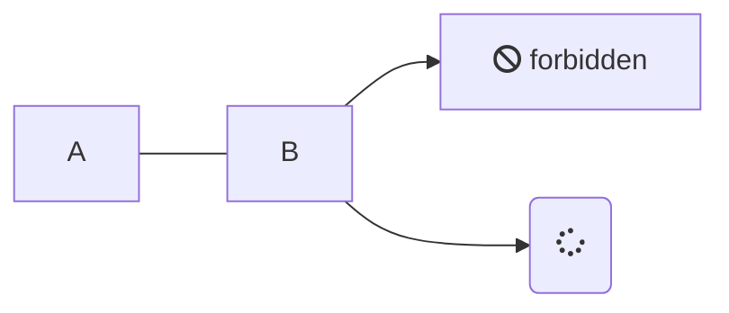
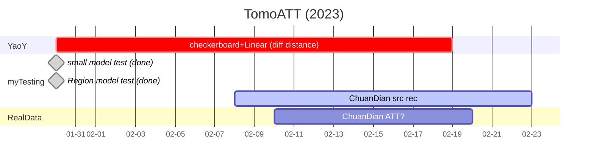
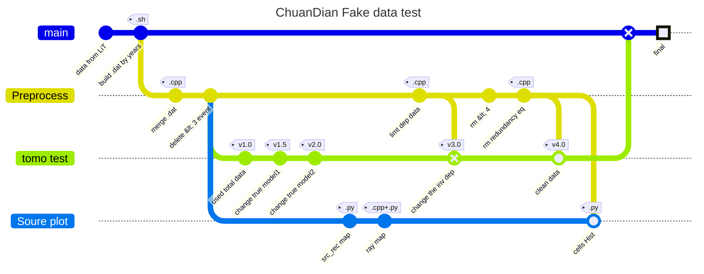

# List processing

## References

### Liu 2021 SRL (CVM1.0)

[link](https://doi.org/10.1785/0220200318)

data processing: 

1. avoid travel time **outliers**
- first remove travel-time data that are away from the main trend of travel-time curves.
- filter out earthquake events that were recorded by fewer than `10` stations
1. remove **redundant** earthquakes
This uneven distribution of body-wave data could lead to unstable inversion problems and result in unreliable features in the inverted velocity models. 
Divided study region into small bins (1-km-thick cell with 3 × 3 km area) and only use one randomly selected event in each bin.

## TomoATT work before 2023

**Root:** D:\zhangxzh\work\Model_China\TomoATT
**Path:** /home/zhangxz/work/tomo/adjointTraveltime/examples

- 小区域模型测试 (**done**)
- 大区域模型测试 (**done**)

## TomoATT work in 2023

- YaoY 不同震中距测试 (checkerboard test)
...ing
- 川滇实际数据（台站位置和地震位置，from LiT）
**path:** /home/zhangxz/work/tomo/adjointTraveltime/real/ChuanDian_liT
...ing

- **Process Map**

_**Source plot:**_
> **src_rec map:** src and rec 的平面图和深度剖面
> **ray map:** 计算射线密度（本质上是`np.histogram2d`）, and plot it.
> **cells Hist:** calculated the `count` in each cells by C++, and plot the `histogram`

- script
build `.dat` by years  :  `src_rec_stati.sh`
merge `.dat` and delete `<3 recorded` events         : `test2_v2.cpp`
计算射线密度： `line_density.cpp`, plot: `plot_line_density.py`
plot src and rec 空间分布: `plot_src_rec.py` and `plot_src_rec_dep.py`
   

