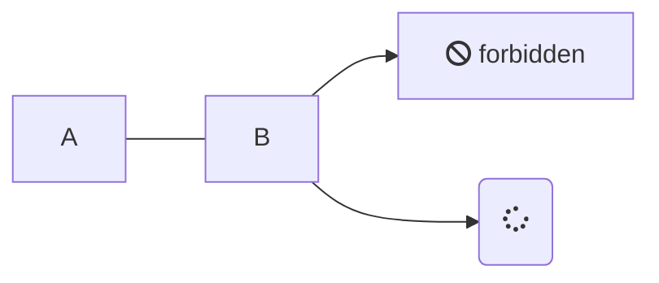
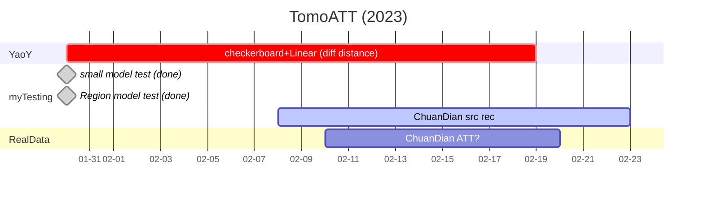
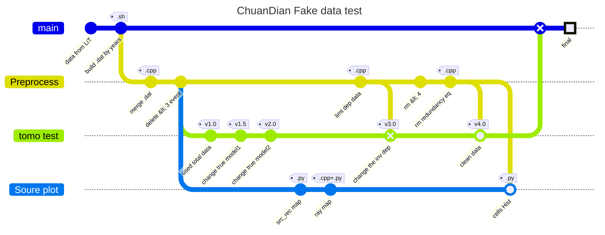

# List processing



## TomoATT detail

### Params input

_**station location:**_ Lat, Lon, Depth (in meter, negetive (`-`) if beneth ground)
_**source location:**_ Lat, Lon, Depth (in km, plus (`+`) beneth ground)

_**min_max_dep:**_ the min_dep should be negetive depth, which means the outer boundary of the calculation area is slightly out of bounds. For example, `[-10.0, 100.0]`. The unit in km.

### Checkerboard test

通常对一个波长的perturbation用`5`个点来采样，从而决定空间网格划分。

### Model update

1. First, calculated `kernel` using [`Fast Sweeping`](https://en.wikipedia.org/wiki/Fast_sweeping_method) method. 然后使用多重反演网格 `multiple inversion grid` 对 `kernel` 进行光滑，得到了光滑化之后的 `kernel`.
2. `kernel` 除以 `kernel` 的最大值，乘上 `step size`，作为模型的更新量. (normalization)
3. 模型更新方法：似乎是**梯度下降法**。

```cpp
inline int optim_method = 0; // 0: gradient descent, 1: halve_stepping, 2: LBFGS
```

> 举个例子，如果 `step size = 0.01`，那么就意味着在 `kernel` 最大的地方, 模型会改变 `±1%`，对应其他地方，则会根据`kernel` 的相对大小, 更新对应的扰动值. 再例如，如果 `step = 0.01`，全空间 `kernel` 最大值为 `20`，在某一点，如果 `kernel` 值为 `-20`， 速度模型就更新 `-1%`； 如果 `kernel` 值为 `10`，速度模型就更新 `+0.5%`.

### Some notes

- 低速区恢复较慢，因为地震射线只会走高速区域，不会走低速区，因此低速区收敛较慢，甚至无法恢复至原始的模型
- 反演区域要***大于等于***正演区域
- 改变 `stencil_type` 不同的算法，改成1为迎风格式，速度更快，但精度较低，具体见examples
- 可以使用***不均匀***的网格，具体见examples

## References

### Liu 2021 SRL (CVM1.0)

[link](https://doi.org/10.1785/0220200318)

data processing: 

1. avoid travel time **outliers**
- first remove travel-time data that are away from the main trend of travel-time curves.
- filter out earthquake events that were recorded by fewer than `10` stations
1. remove **redundant** earthquakes
This uneven distribution of body-wave data could lead to unstable inversion problems and result in unreliable features in the inverted velocity models. 
Divided study region into small bins (1-km-thick cell with 3 × 3 km area) and only use one randomly selected event in each bin.

## TomoATT work before 2023

**Root:** D:\zhangxzh\work\Model_China\TomoATT
**Path:** /home/zhangxz/work/tomo/adjointTraveltime/examples

- 小区域模型测试 (**done**)
- 大区域模型测试 (**done**)

## TomoATT work in 2023


- YaoY 不同震中距测试 (checkerboard test)
...ing
- 川滇实际数据（台站位置和地震位置，from LiT）
**path:** /home/zhangxz/work/tomo/adjointTraveltime/real/ChuanDian_liT
...ing

- **Process Map**


_**tomo test:**_
> v1.0: 最原始的反演，使用了全部数据（震源被3个以上台站接受, about `109183` sources）.
> v1.5: 在v1.0的基础上改变了 true model.
> v2.0: 在v1.5的基础上改变了 true model. perturbation 更小了.
> v3.0: 在v2.0的基础上改变了 true model. 反演模型深度为35km.
> v4.0: 

_**Source plot:**_
> **src_rec map:** src and rec 的平面图和深度剖面
> **ray map:** 计算射线密度（本质上是`np.histogram2d`）, and plot it.
> **cells Hist:** calculated the `count` in each cells by C++, and plot the `histogram`

- script
build `.dat` by years  :  `src_rec_stati.sh`
merge `.dat` and delete `<3 recorded` events         : `test2_v2.cpp`
计算射线密度： `line_density.cpp`, plot: `plot_line_density.py`
plot src and rec 空间分布: `plot_src_rec.py` and `plot_src_rec_dep.py`
   

