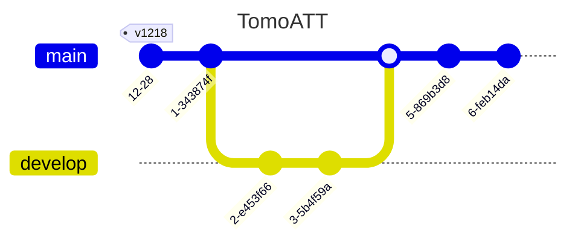

# List processing

## TomoATT work before 2023

**Root:** D:\zhangxzh\work\Model_China\TomoATT
**Path:** /home/zhangxz/work/tomo/adjointTraveltime/examples

- 小区域模型测试 (**done**)
- 大区域模型测试 (**done**)

## TomoATT work in 2023

- YaoY 不同震中距测试 (checkerboard test)
...ing
- 川滇实际数据（台站位置和地震位置，from LiT）
**path:** /home/zhangxz/work/tomo/adjointTraveltime/real/ChuanDian_liT
...ing
